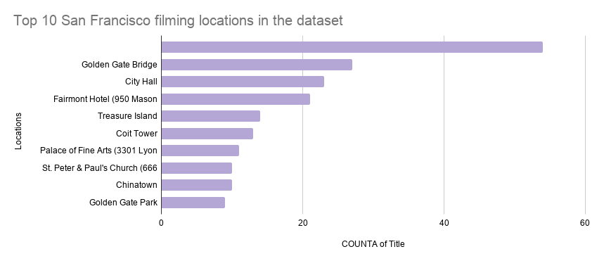
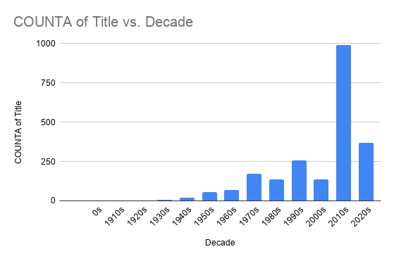

# San Francisco’s most filmed locations show how the city becomes a movie backdrop

## Research Questions
1. Which San Francisco filming locations appear most often in the dataset?
2. Which decades have the most listed film and television productions?
3. What can this dataset show, and what can it not show?

## Dataset
This project uses the Film Locations in San Francisco dataset from DataSF. The dataset is published through San Francisco’s open data portal and is provided by the San Francisco Film Commission. It includes information about movies and television productions connected to San Francisco, including titles, release years, filming locations, production companies, directors, writers, and actors.
This is a useful source because it comes from a city agency connected to film activity in San Francisco. However, it still has limitations. The dataset should not be treated as a perfect list of every film or television production ever filmed in the city. Some productions or locations may be missing, and some locations may be written in slightly different ways.

## Methods

The Film Locations in San Francisco dataset was downloaded from DataSF and imported into Google Sheets. The project focused on the title, release year, and location columns. Pivot tables were created to count how often each filming location appeared and how many listings appeared in each decade.

For the decade analysis, a new column was created to group release years into decades. A pivot table was then used to count the number of titles in each decade. Bar charts were used because they are useful for comparing categories, such as locations and decades.

Google Sheet: [View my analysis spreadsheet here](https://docs.google.com/spreadsheets/d/1TUhxm7UXssgIjPeq7-At_qdzKpk1TPCT5c15GU1ET34/edit?usp=sharing)

## Finding 1: Some San Francisco locations appear again and again

**Chart 1. Top San Francisco filming locations in the dataset.**  
This chart shows the filming locations that appear most often in the Film Locations in San Francisco dataset. The chart suggests that certain places in San Francisco are repeatedly used as movie and television backdrops. These locations may be popular because they are visually recognizable or strongly connected to the city’s image on screen. However, the chart does not show how long each location appeared in a film or how important the location was to the story. Source: DataSF / San Francisco Film Commission.

## Finding 2: Filming activity changes across decades

**Chart 2. Film and television listings by decade.**  
This chart groups the dataset by release decade. It shows how many film and television location listings appear in each decade. The chart helps show how the dataset’s coverage changes over time. However, it does not prove that one decade had more filming activity than another in real life. It only shows how many listings are included in this public dataset. Source: DataSF / San Francisco Film Commission.

## Limitations

This dataset should not be treated as a complete list of every movie or television production filmed in San Francisco. The data only includes the productions and locations recorded in the Film Locations in San Francisco dataset. Some productions may be missing, especially smaller projects, older productions, independent films, or productions that were not recorded in the same way. Because of this, the charts should be understood as a summary of this dataset rather than a full history of filming in San Francisco.

Another limitation is that the dataset counts filming-location listings, not screen time or story importance. A location that appears many times in the dataset is not automatically the most important filming location in San Francisco film history. It only means that the location appears often in the available records. One movie may use a location for only a short scene, while another production may make a different location central to the story. The dataset does not show that difference.

There may also be inconsistencies in how locations are written. The same place could be listed in different ways, such as by street name, landmark name, neighborhood name, or full address. If the same location appears under slightly different names, the count may be split across multiple rows. This could affect which locations appear in the top results.

The decade chart also has limits because it uses release year, not the exact date when filming happened. A production released in one decade may have been filmed earlier. This means the chart is useful for showing patterns in the dataset, but it should not be read as an exact timeline of when filming activity happened in San Francisco.

Overall, the dataset is useful for identifying patterns in recorded film and television locations, but it cannot fully explain why those patterns exist. It shows where filming was recorded, but not why those places were chosen, how long filming lasted, how the locations were represented on screen, or how local residents experienced the production.

## Ethical Concerns and Reporting Process

This project does not involve private personal information, so it is less sensitive than datasets about crime, health, income, or immigration. However, there are still ethical concerns in how the data is presented. The data can shape how readers think about San Francisco neighborhoods. If certain locations appear often in movies or television shows, those places should not only be understood as tourist attractions or filming backgrounds. They are also real neighborhoods where people live, work, and build community.

Another concern is that film and television can influence public perception of a place. A neighborhood may be used on screen to create a certain mood, image, or stereotype, but the dataset does not show whether that representation was fair or accurate. The data only records filming locations. It does not include the voices of residents, workers, or community members who may be affected by filming or by how their neighborhood is portrayed.

A more complete story would require additional reporting beyond the dataset. Interviews with the San Francisco Film Commission could help explain how the data was collected, how complete it is, and what types of productions may be missing. Interviews with local filmmakers could provide more context about why certain locations are chosen and what makes them useful for storytelling. Residents and small business owners in commonly filmed areas could also explain how film production affects daily life, including street closures, noise, tourism, business activity, or neighborhood image.

Additional reporting could also compare this dataset with other records, such as film permits, production notes, or neighborhood-level information. This would help turn the project from a basic data analysis into a fuller public-facing story about how San Francisco is used, represented, and experienced as a filming location.

## Source

DataSF, “Film Locations in San Francisco,” data provided by the San Francisco Film Commission.

